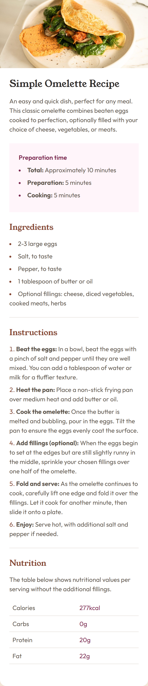
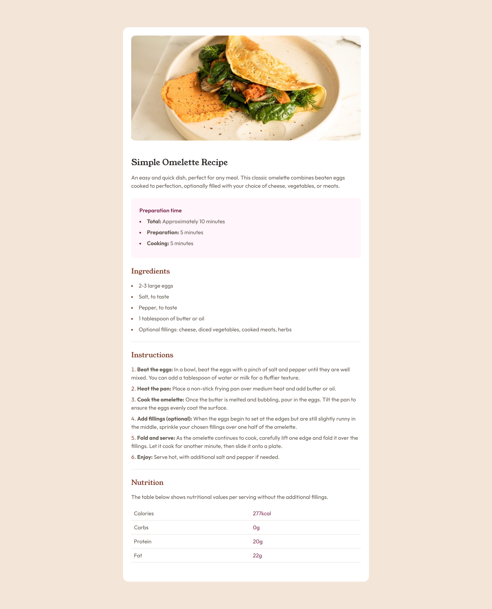

# Frontend Mentor - Recipe page solution

This is a solution to the [Recipe page challenge on Frontend Mentor](https://www.frontendmentor.io/challenges/recipe-page-KiTsR8QQKm).

## Table of contents

- [Screenshot](#screenshot)
- [Links](#links)
- [My process](#my-process)
- [Built with](#built-with)

### Screenshot

### Links

- Solution URL: [Code](https://github.com/nicolasfig/recipe-page)
- Live Site URL: [Site](https://nicoweb.site/recipe-page)

### Built with

- Semantic HTML5 markup
- CSS custom properties
- Flexbox
- Tailwindcss
- Mobile-first workflow
- [Tailwindcss](https://tailwindcss.com/) - For styles
